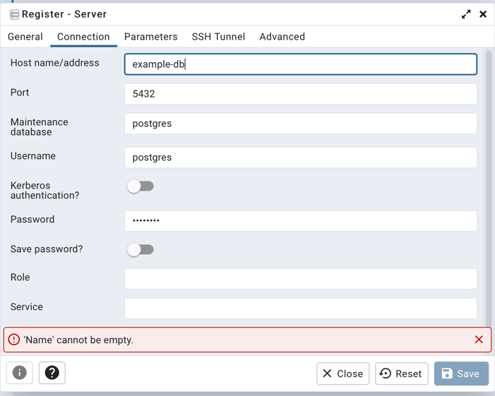

# Spring boot example

Ce projet est un exemple pour les L3 MIAGE de grenoble. Il peut être utilisé comme projet d'amorce.

# Prérequis

## Pour les VM

Plusieurs installations sont nécessaires pour les VMs :
1) Installer JDK 11
    ```shell
    sudo apt install openjdk-11-jdk
    export JAVA_HOME=/usr/lib/jvm/java-1.11.0-openjdk-amd64
    ```
2) Installer maven
    ```shell
    sudo apt install maven
    ```
3) Installer docker-compose
    ```shell
    sudo apt install docker-compose
    ```

## En local

Pensez à avoir :
* Avoir `java 11`
* Avoir `maven`
* Avoir `docker desktop`
  * Si docker n'est pas installé, aller voir ce <a href="https://docs.docker.com/desktop/install/windows-install/">tuto</a>
* Avoir `docker-compose`
  * Si docker-compose n'est pas installé, aller voir ce <a href="https://docs.docker.com/compose/install/">tuto</a>

# Base de données via docker

Pour installer la BD postgres, vous n'avez qu'à compiler le docker compose, mettez vous à la racine du projet et tapez la commande suivante : 
```shell
docker-compose -f docker/docker-compose.yml up
```

Cette commande va créer 2 containers, un `postgres` et `pgAdmin`

## Postgres

* Les identifiants :
```yml
username: postgres
password: postgres
url: jdbc:postgresql://localhost:5432/
driver-class-name: "org.postgresql.Driver"
```

## PgAdmin

* Vous permet d'avoir une vision directe sur votre base de données
* Identifiant de connexion :
```yml
email : admin@admin.com
password: root
```

Étapes pour connecter votre bd :
1) Ajouter un serveur dans pgAdmin

2) Remplir avec les informations suivantes :
   ```yml
   host: localhost
   port: 5432
   username: postgres
   password: postgres
   ```
   en photo :

    

# Compilation du projet

* Pour compiler, vous devez utiliser `maven` avec la commande suivante :
```shell
mvn clean install
```
# Lancement du serveur

2 manières de le lancer sont possibles : 

## En CLI
Ici, vous allez démarrer votre serveur dans un terminal avec la commande : 
```shell
java -jar server/target/Example.jar
```
Vous pouvez aussi le mettre en arrière-plan avec la commande :
```shell
java -jar server/target/Example.jar &
```

## Via votre éditeur

Dans votre éditeur vous n'avez qu'à lancer le main dans le fichier `ExampleSpringApplication`


# Swagger

* Vous trouverez le swagger, lorsque votre serveur est **démarré**, à l'adresse suivante : 
<a href="http://localhost:8080/swagger-ui/index.html?configUrl=/v3/api-docs/swagger-config#/">swagger</a>

# Etapes pour ajouter une opération sur une entité

* Ajouter l'operation dans le repository
* Ajouter l'operation correspondante dans le component
* Ajouter l'operation correspondante dans le service
* Créer le endpoint correspondant et l'implémenter

